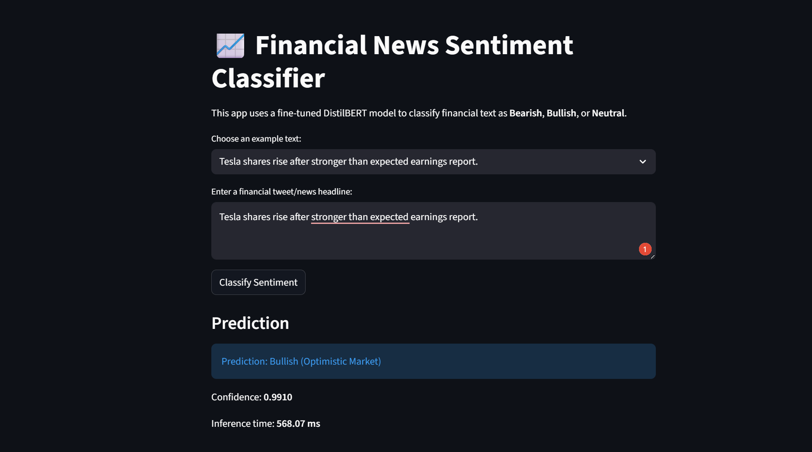
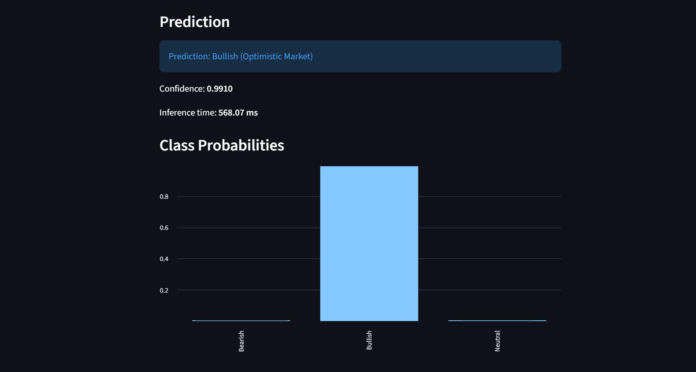
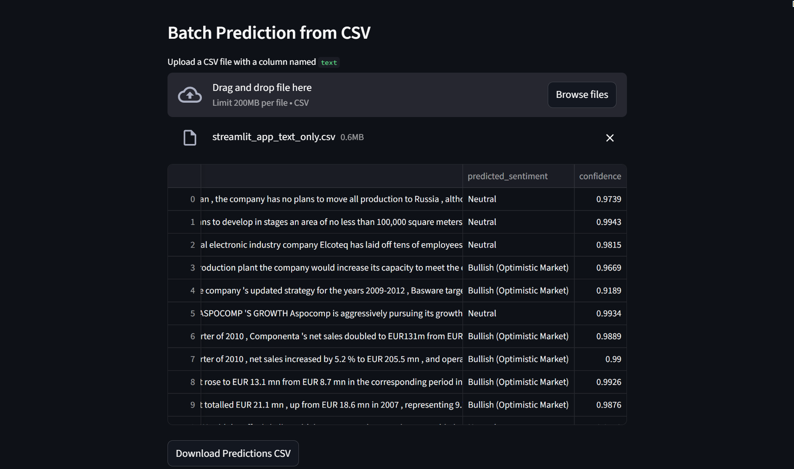

# # Financial Sentiment Classification: DistilBERT vs Few-Shot LLM

Live Demo: https://financial-sentiment-distilbert-vs-llm.streamlit.app/

Financial-Sentiment-Classification Financial Sentiment Classification: Fine-Tuned DistilBERT vs Few-Shot LLM This project focuses on financial sentiment classification using two different Natural Language Processing approaches: 1. A fine-tuned local transformer model: DistilBERT 2. A few-shot Large Language Model approach using prompt engineering.

The main goal of the project is to classify financial tweets/news texts into three sentiment categories:

- Bearish
- Bullish
- Neutral

The project compares the performance, latency, and practical usability of a fine-tuned transformer model against a few-shot LLM-based classifier. For the final interactive application, the fine-tuned DistilBERT model is used because it is faster, cheaper, and does not require an external API key during inference.

---

## Project Overview

Financial sentiment analysis is an important NLP task in finance because market-related news, tweets, and announcements can influence investor behavior and asset movement. In this project, I implemented a sentiment classification pipeline for financial text using deep learning and transformer-based NLP models.

The work is divided into two main parts:

### Part 1: Fine-Tuning DistilBERT

In the first part, I fine-tuned `distilbert-base-uncased` for financial sentiment classification. DistilBERT is a smaller and faster version of BERT, making it suitable for practical deployment while still maintaining strong classification performance.

The fine-tuning pipeline includes:

- Loading the financial sentiment dataset
- Splitting the data into training, validation, and test sets
- Tokenizing text using the DistilBERT tokenizer
- Fine-tuning DistilBERT for 3-class sentiment classification
- Evaluating the model using Accuracy and Macro-F1
- Measuring average inference latency
- Saving the trained model and tokenizer for later deployment

### Part 2: Few-Shot LLM Prompting

In the second part, I implemented a few-shot LLM-based sentiment classifier. Instead of fine-tuning the LLM, I used prompt engineering.

From the fine-tuned distillBert, a streamlit app has been developed for the understanding of the general users.

[
[
[

